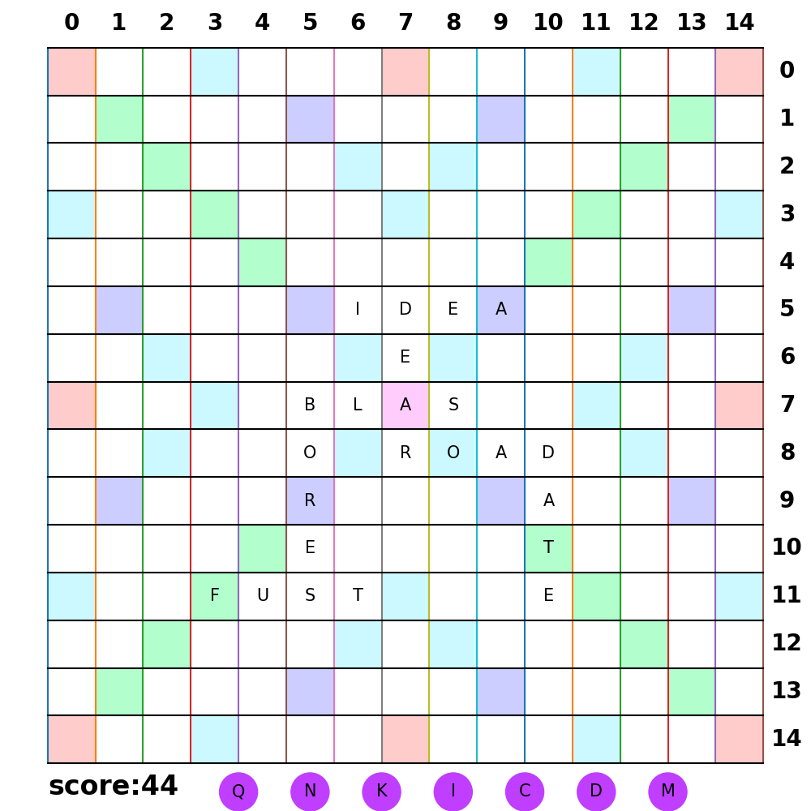

# Juego de Apailabrado
 
## instrucciones del juego
 - Introduce la palabra en Mayuscula
 - La primera palabra siempre debe pasar por la coordenada central
 - A diferencia de la primera palabra, tienes que aprovechar alguna letra para formar la nueva
 - Solo tienes dos opciones para la direccion V (vertical) H (horizontal)
## librerias utilizadas
 - pandas: para la verificacion de palabras y lectura de diccionario.
 - numpy:
 - matplotlib.pyplot: para visualizacion de tablero.
